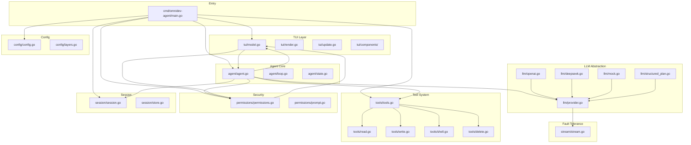
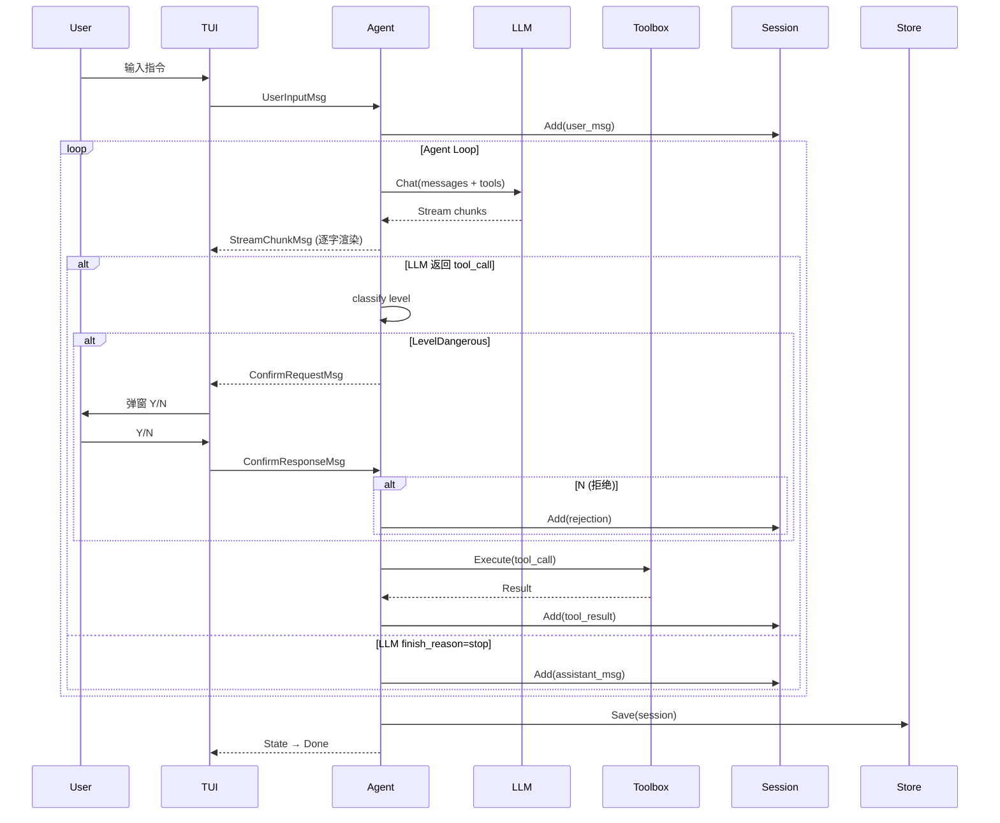

<!-- CHANGE_LOG: 2026-06-26 因需求变更同步更新: 新增 §15 历史项目理解拦截器 + §16 SubAgent 并行调度; §13 去限制化升级 -->
<!-- CHANGE_LOG: 2026-06-26 Phase 1 初始创建 -->
<!-- CHANGE_LOG: 2026-06-26 DeepSeek 接入支持: §5.2 Provider 表、§8.2 配置项、架构图均补入 DeepSeek -->
<!-- CHANGE_LOG: 2026-06-26 v1.3: §4权限收紧 + §12上下文摘要管理 + §13历史项目理解先行 + 目录结构更新 -->

# 01 — Architecture Blueprint

> 基于需求文档 v1.1，从现状骨架代码出发，设计完整架构。

---

## 1. 模块全景与依赖关系



**依赖方向**: TUI → Agent → LLM/Tools/Permissions/Session → Config。无循环依赖。

---

## 2. Agent Loop（核心闭环）

### 2.1 状态机

```
Idle → Thinking → (Executing | WaitingApproval) → Thinking → ... → Done | Error
  ↑                                                                    │
  └──────────────────── 用户新指令 ←───────────────────────────────────┘
```

| 状态 | 触发条件 | 行为 |
|------|----------|------|
| `Idle` | 初始 / 任务完成 | 等待用户输入 |
| `Thinking` | 接收指令后 | 调用 LLM，流式输出 |
| `Executing` | LLM 返回 tool_call | 执行工具，结果回传 |
| `WaitingApproval` | 高危工具调用 | TUI 弹窗，等待用户 Y/N |
| `Done` | LLM 返回 finish_reason=stop | 输出总结，回 Idle |
| `Error` | LLM 超时 3 次 / 工具异常 | 输出错误，回 Idle |

### 2.2 主循环流程

```
func (a *Agent) Run(ctx, instruction) {
    1. session.Add(user_message)
    2. for turn := 0; turn < maxTurns; turn++ {
        3. buildMessages(session) → []llm.Message
        4. llmResp := provider.Chat(messages + toolDefs)
        5. if llmResp.Content != "":
             session.Add(assistant_message)
             emit StreamChunk to TUI
        6. if llmResp.ToolCalls != nil:
             for each toolCall:
                7. level := classifyTool(toolCall.Name)
                8. if level == LevelDangerous:
                     emit ConfirmRequest to TUI, WAIT for response
                     if denied: session.Add(rejection), continue
                9. result := toolbox.Execute(toolCall)
                10. session.Add(tool_result)
                11. continue loop (feed result to LLM)
        7. if finish_reason == "stop": break → Done
    }
    8. store.Save(session)
}
```

### 2.3 Agent ↔ TUI 通信协议

```go
// TUI → Agent
type UserInputMsg struct { Instruction string }
type ConfirmResponseMsg struct { Granted bool }

// Agent → TUI
type AgentStateMsg struct { State State }
type StreamChunkMsg struct { Content string; Done bool }
type ToolCallMsg struct { Name string; Args map[string]any; Status string }
type ToolResultMsg struct { Success bool; Data string; Error string }
type ConfirmRequestMsg struct { Level Level; Description string; Reply chan<- bool }
type ErrorMsg struct { Error string; Retry int }
```

通过 Bubbletea 的 `tea.Cmd`/`tea.Msg` 机制传递。Agent goroutine 通过 channel 发送消息，TUI 的 `Update()` 方法处理消息并重新渲染。

---

## 3. 工具系统

### 3.1 接口（已有）

```go
type Tool interface {
    Name() string
    Description() string       // LLM function description
    Parameters() map[string]any // JSON Schema for function calling
    Level() permissions.Level  // LevelSafe or LevelDangerous
    Execute(ctx, args) *Result
}
```

### 3.2 工具清单

| 工具 | 包 | Level | 说明 |
|------|-----|-------|------|
| `list_dir` | read.go | Safe | 遍历目录树 |
| `read_file` | read.go | Safe | 读取文件内容 |
| `search_file` | read.go | Safe | 按名称模糊匹配 |
| `search_code` | read.go | Safe | 关键词/正则搜索 |
| `write_file` | write.go | Dangerous | 新建/覆盖文件（需用户确认 + 项目理解检查） |
| `edit_file` | write.go | Dangerous | 增量修改（需用户确认 + 项目理解检查） |
| `shell_exec` | shell.go | Dangerous | 执行 Shell 命令（需用户确认） |
| `delete_file` | delete.go | Dangerous | 删除文件/目录（需用户确认） |

### 3.3 工具调用结构（OpenAI Function Calling 兼容）

```json
{
  "name": "write_file",
  "arguments": {
    "path": "internal/tools/git_diff.go",
    "content": "package tools\n\n..."
  }
}
```

Registry 在启动时注册全部工具，Agent Loop 将工具定义传给 LLM，LLM 返回 tool_calls 后由 Registry 分发执行。

---

## 4. 权限控制（v1.1）

```
LevelSafe           LevelDangerous
─────────           ──────────────
list_dir            shell_exec
read_file           delete_file
search_file         write_file
search_code         edit_file
```

**执行流程**:
```
tool.Execute() 前 → checker.RequiresApproval(tool.Level())
  ├── false → 直接执行
  └── true → checker.Request() → TUI 弹窗
                ├── Y → 执行
                └── N → 拒绝，记录到 session，LLM 调整策略
```

`Checker.Request()` 向 TUI 发送 `ConfirmRequestMsg`，TUI 渲染确认弹窗（带工具名、参数预览），等待键盘 Y/N。

---

## 5. LLM 抽象层

### 5.1 Provider 接口（已有，需增强）

```go
type Provider interface {
    Chat(ctx, *Request) (*Response, error)
    Stream(ctx, *Request) (<-chan *Chunk, error)
}
```

### 5.2 实现计划

| Provider | 文件 | 依赖 | 说明 |
|----------|------|------|------|
| OpenAI | openai.go | `github.com/sashabaranov/go-openai` | 标准 OpenAI 协议实现 |
| DeepSeek | deepseek.go | 复用 openai.go | DeepSeek API 完全兼容 OpenAI 协议，仅 BaseURL 和 APIKey 不同 |
| Mock | mock.go | 纯 Go，测试用 | 模拟 LLM 返回，用于单元测试 |

> DeepSeek（包括 deepseek-chat、deepseek-reasoner）的 Chat/Stream/Tool Calling API 均兼容 OpenAI 协议，无需独立 Provider 实现。`deepseek.go` 仅封装默认 BaseURL (`https://api.deepseek.com/v1`) 和模型名常量，底层复用 `openai.go`。

### 5.3 结构化计划解析

LLM 可能在回复中嵌入 JSON 格式的 multi-step plan。Response 解析时尝试提取 JSON block；若失败则降级为普通 function calling 解析。

```go
// structured_plan.go — 结构化计划解析器
type StructuredPlan struct {
    Steps []Step `json:"steps"`
}
type Step struct {
    ID    string `json:"id"`
    Action string `json:"action"`  // "tool_call" | "reasoning" | "output"
    Tool  string `json:"tool,omitempty"`
    Args  map[string]any `json:"args,omitempty"`
}
```

---

## 6. 会话管理

### 6.1 数据结构（已有，待增强）

```go
type Entry struct {
    Timestamp time.Time
    Role      string      // user / assistant / tool / system
    Content   string
    ToolCalls []ToolCallEntry
    State     string      // 新增：agent 当时状态
    Tokens    int         // 新增：token 消耗
}
```

### 6.2 持久化

```
Store.Save(session) → .ai_history/sessions/{timestamp}.json  // 结构化
Store.Export(session) → .ai_history/sessions/{timestamp}.md   // 可读版
```

每个 session（一次程序启动）一个文件。程序退出时自动保存。

---

## 7. TUI 界面布局

```
┌──────────────────────────────────────────────┐
│  omnidev-agent v1.0          │ [Thinking]    │  ← titlebar
├──────────────────────────────────────────────┤
│                                              │
│   Welcome to omnidev-agent v1.0              │  ← messages area
│   Type a command and press Enter.            │     (可滚动)
│                                              │
│   > 帮我写一个排序函数                       │  ← user input
│                                              │
│   [Thinking] 让我分析一下...                 │  ← LLM streaming
│   好的，我来写一个快速排序...                │
│                                              │
│   ⚙ [Tool] write_file(path=sort.go)          │  ← tool call
│   ✔ [Result] 写入成功，128 bytes             │
│                                              │
├──────────────────────────────────────────────┤
│  > _                                         │  ← input line
├──────────────────────────────────────────────┤
│  Ctrl+C / quit to exit                       │  ← footer
└──────────────────────────────────────────────┘
```

**弹窗层**（确认对话框，覆盖在消息区域上方）:
```
╔══════════════════════════════════════╗
║  ⚠ Permission Required              ║
║                                     ║
║  Operation: shell_exec              ║
║  Command:   rm -rf ./build          ║
║                                     ║
║  [Y] Approve  [N] Deny              ║
╚══════════════════════════════════════╝
```

### 7.1 组件树

```
model (tui.go)
├── titlebar.go    — 标题栏 + 状态指示
├── messages.go    — 可滚动消息列表
├── input.go       — 输入行
├── confirm.go     — 权限确认弹窗
├── status.go      — 状态标签着色
└── styles.go      — Lipgloss 样式集中定义
```

### 7.2 状态刷新机制

Agent.State() 变化时 → 发送 `AgentStateMsg` → TUI 更新 titlebar 状态标签 → 触发 `tea.Batch` 重绘。

流式输出时：每个 chunk → 追加到最后一条消息文本 → 刷新。

---

## 8. 配置管理

### 8.1 分层优先级（由高到低）

```
CLI flags > 环境变量 > 项目配置 (./.omnidev-agent.json) > 全局配置 (~/.omnidev-agent/config.json) > 默认值
```

### 8.2 配置项

```go
type Config struct {
    // LLM
    Provider    string `json:"provider"`     // openai | deepseek
    APIKey      string `json:"api_key"`
    BaseURL     string `json:"base_url"`     // https://api.deepseek.com/v1
    Model       string `json:"model"`        // deepseek-chat | deepseek-reasoner
    MaxTokens   int    `json:"max_tokens"`
    Temperature float64 `json:"temperature"`
    Timeout     int    `json:"timeout"`       // seconds

    // Agent
    MaxTurns    int    `json:"max_turns"`     // 最大推理轮次
    Interactive bool   `json:"interactive"`   // 是否启用弹窗确认

    // Logging
    LogLevel    string `json:"log_level"`     // debug | info | warn | error
    LogDir      string `json:"log_dir"`       // .ai_history/sessions/

    // TUI
    Theme       string `json:"theme"`         // dark | light

    // Context window management (v1.3)
    ContextMaxTokens          int     `json:"context_max_tokens"`          // 120000 default
    ContextSummarizeThreshold float64 `json:"context_summarize_threshold"` // 0.95 default
}
```

---

## 9. 上下文摘要管理 (v1.3)

### 9.1 概念

模拟 Cursor Agent 的分层上下文窗口管理：设置 token 上限（默认 120K），
当估算 token 占用超过阈值（默认 95%）时，自动对旧轮次进行 LLM 摘要压缩，
确保上下文窗口永不溢出且旧信息不丢失。

### 9.2 触发条件

- `estimated_tokens > ContextMaxTokens × ContextSummarizeThreshold`
- 估算公式：`utf8.RuneCount(content) / 3 + 1`（混合中英文粗略估算）
- 仅在 `session.Entries > keepLast` 时压缩（保留最近 10 条原始记录）

### 9.3 压缩流程

```
1. ShouldSummarize(entries) → bool
2. 若true → SummarizeEarlyEntries(entries[:n-keepLast], keepLast)
3. LLM 摘要 prompt → 压缩为一条 system entry "[EARLY CONTEXT SUMMARY]..."
4. 替换 session entries: [summary] + entries[n-keepLast:]
5. buildMessages() 使用压缩后 entries
```

### 9.4 容错降级

LLM 摘要调用失败时，直接截断只保留最近 `keepLast` 条记录。

### 9.5 配置

| 参数 | 默认值 | 环境变量 |
|------|--------|----------|
| ContextMaxTokens | 120000 | `OMNIDEV_CONTEXT_MAX_TOKENS` |
| ContextSummarizeThreshold | 0.95 | `OMNIDEV_CONTEXT_SUMMARIZE_THRESHOLD` |

---

## 10. 容错工程

| 场景 | 策略 |
|------|------|
| LLM 请求超时 | 3 次重试，指数退避 (1s, 2s, 4s) |
| LLM 返回格式异常 | JSON 解析失败时降级为纯文本回复 |
| 工具执行异常 | 捕获 panic，返回结构化错误，LLM 基于错误调整 |
| 流式中断 | 检测 channel close，标记 incomplete |
| Shell 超时 | context.WithTimeout 30s，超时后 kill 进程 |

---

## 11. 数据流总览



---

## 12. 历史项目理解先行规则 (v1.3)

### 12.1 核心原则

修改既有项目文件前，**必须**先用工具完成以下四步理解流程，禁止跳过直接修改。

```
Step 1: list_dir("/")        → 了解项目目录结构、技术栈
Step 2: read_file("README")  → 理解项目定位、构建方式
Step 3: search_code(keyword) → 了解代码风格、命名约定、架构模式
Step 4: read_file(关键入口)  → 理解模块边界、依赖关系
```

### 12.2 输出约束

- 理解结果必须写入 session history (role: system)，供后续 LLM 轮次参考
- 修改代码时必须遵循既有风格（缩进、命名、分层、注释习惯）
- **禁止**：引入现有项目不使用的第三方库
- **禁止**：改变现有文件的目录结构
- **禁止**：重写与需求无关的代码

### 12.3 项目类型区分

| 项目类型 | 触发条件 | Agent 行为 |
|----------|----------|-----------|
| **Greenfield** | 工作目录为空或仅有脚手架 | 跳过理解流程，直接创建文件 |
| **Legacy** | 工作目录已有项目文件 | **强制**执行四步理解流程，完成后才能调用写/删工具 |
| **Mixed** | Greenfield 项目框架但含外部依赖 | 只分析依赖结构，不完整扫描 |

---

## 13. Agent 职责边界 (v2.0 升级)

- ~~Agent 自身不包含任务规划器/并行调度~~ **已升级**：v2.0 内置 TaskDispatcher，
  支持任务拆解 + SubAgent 并行执行。详见 §16。
- **结构化计划用于拆解**：multi-step plan JSON 格式，
  Agent Loop 只负责逐个 step 执行，不做 plan 编排。
- **最终目标**：Agent 作为可靠的"单指令执行器"——读取、编写、搜索、Shell——
  在理解项目后精准完成单步任务。复杂编排内置 TaskDispatcher 驱动。

---

---

## 15. 历史项目理解拦截器 — ProjectAwarenessGuard (v2.0)

### 15.1 核心原则

修改既有项目文件前，Agent Loop **硬拦截**对 // 的调用，
直到已完成项目理解流程并将结果注入 session context。

### 15.2 拦截规则


### 15.3 理解流程（自动触发）

| Step | 操作 | 工具 | 目的 |
|------|------|------|------|
| 1 | 列出项目顶层目录 |  | 识别项目类型、技术栈、目录概览 |
| 2 | 读取 README / 构建文件 |  | 项目目的、构建方式、依赖声明 |
| 3 | 搜索关键模式 |  | 命名约定、导入风格、错误处理模式 |
| 4 | 读取入口文件 |  | 程序入口、模块边界、核心抽象 |

完成后的理解摘要注入 session context（role: system, prefix: [PROJECT ANALYSIS]），
Guard 标记 ，后续写操作不再拦截。

### 15.4 项目类型检测

| 检测条件 | 类型 |
|----------|------|
| 工作目录无构建文件 &&  不存在 | Greenfield |
| 工作目录已有  且有  文件 ≥ 3 | Legacy — Go |
| 工作目录已有  且有  文件 ≥ 3 | Legacy — Node |
| 其他 | Legacy |

### 15.5 容错

- 理解流程任何 Step 失败不阻塞后续 Step
- 理解流程整体超时 30s，超时后降级为仅记录已收集信息
- Greenfield 项目不做理解流程，Guard 初始即 

---

## 16. SubAgent 并行调度引擎 — TaskDispatcher (v2.0)

### 16.1 架构


### 16.2 SubAgent 生命周期


### 16.3 并行控制

| 参数 | 默认值 | 说明 |
|------|--------|------|
|  | 4 | 最大并行 SubAgent 数 |
|  | 120 | 单个 SubAgent 超时 |
|  | 10 | 单个 SubAgent 最大推理轮次 |

### 16.4 TUI 展示

每个 SubAgent 在 TUI 中显示为独立任务行情：


### 16.5 与现有架构的关系

- 单步简单请求 → 走现有  的 Agent Loop（无 SubAgent）
- 复杂请求 → TaskDispatcher 拆解后 spawn 多个 SubAgent
- SubAgent 内部仍走相同 Agent Loop 逻辑

---
## 14. 目录结构（目标）

```
omnidev-agent/
├── cmd/omnidev-agent/main.go
├── internal/
│   ├── agent/
│   │   ├── agent.go          # Agent struct + state machine
│   │   ├── loop.go           # Run() 主循环
│   │   ├── guard.go          # 历史项目理解拦截器 (v2.0)
│   │   ├── dispatcher.go     # SubAgent 并行调度 (v2.0)
│   │   ├── context.go        # 上下文窗口管理 (v1.3)
│   │   └── messages.go       # TUI 通信消息类型
│   ├── llm/
│   │   ├── provider.go       # Provider 接口
│   │   ├── openai.go         # OpenAI 实现
│   │   ├── mock.go           # Mock 实现（测试用）
│   │   └── structured_plan.go # 结构化计划解析
│   ├── tools/
│   │   ├── tools.go          # Tool 接口 + Registry
│   │   ├── read.go           # list_dir, read_file, search_file, search_code
│   │   ├── write.go          # write_file, edit_file
│   │   ├── shell.go          # shell_exec
│   │   └── delete.go         # delete_file
│   ├── permissions/
│   │   ├── permissions.go    # Checker + Level
│   │   └── prompt.go         # TUI 弹窗确认逻辑
│   ├── session/
│   │   ├── session.go        # Session + Entry
│   │   └── store.go          # JSON 持久化 + MD 导出
│   ├── config/
│   │   ├── config.go         # Config 结构 + 默认值
│   │   └── layers.go         # 分层加载合并
│   ├── tui/
│   │   ├── tui.go            # Bubbletea model
│   │   ├── update.go         # Update 方法
│   │   ├── render.go         # View 方法
│   │   ├── styles.go         # Lipgloss 样式
│   │   └── components/
│   │       ├── titlebar.go
│   │       ├── messages.go
│   │       ├── input.go
│   │       ├── confirm.go
│   │       └── status.go
│   └── stream/
│       └── stream.go         # 流式解析 + 超时重试
├── tests/                    # 测试用例
├── docs/
│   ├── 需求文档.md
│   └── omnidev-state/
├── .ai_history/sessions/
├── deliverables/
├── CLAUDE.md
├── AGENTS.md
├── go.mod
├── .omnidev-agent.json.sample        # Sample config (commit-safe)
├── .omnidev-agent.json            # 项目配置（gitignored）
└── README.md
```
